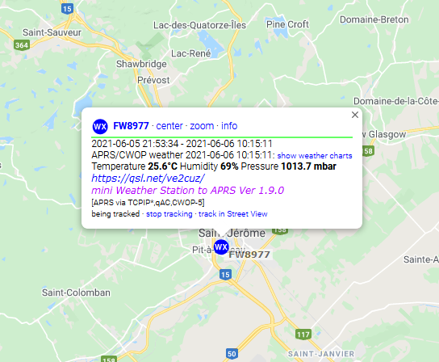
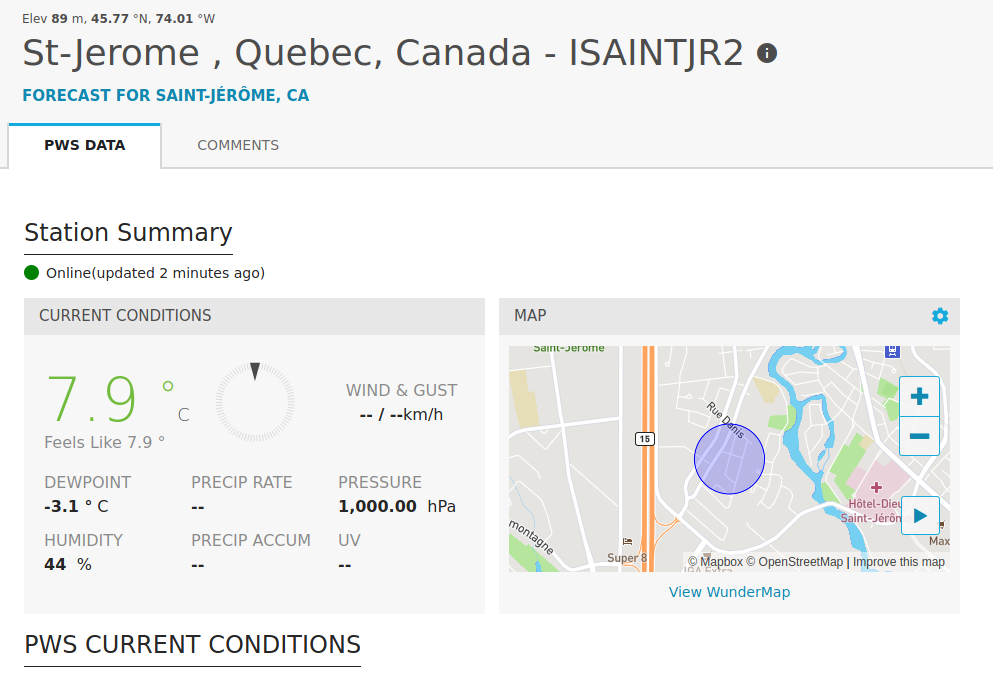
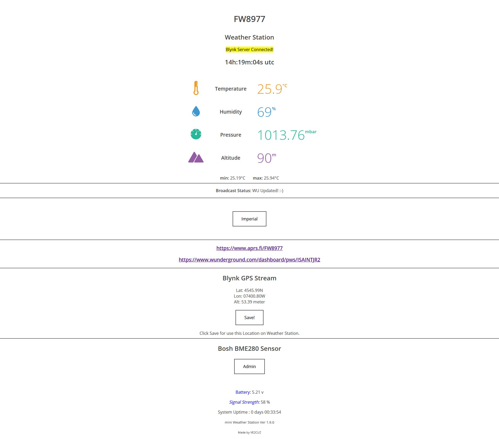
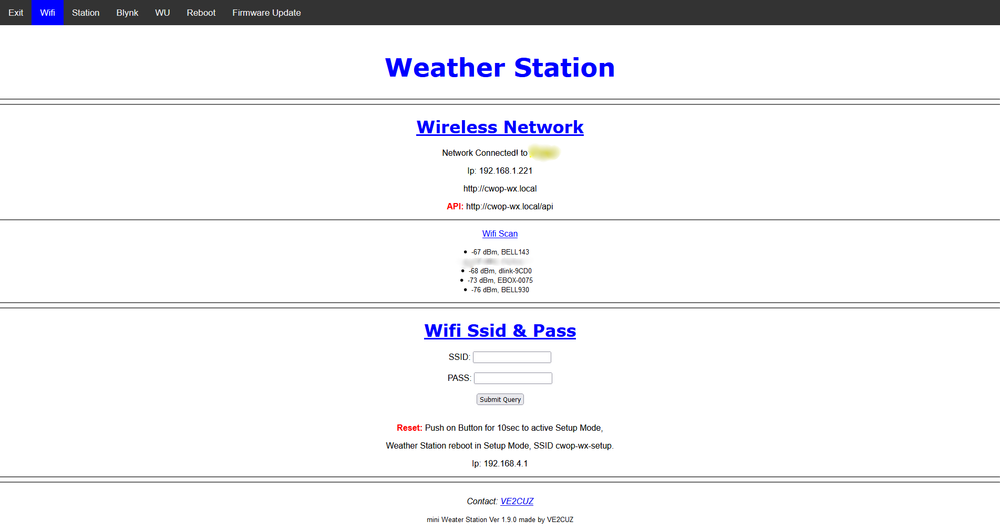
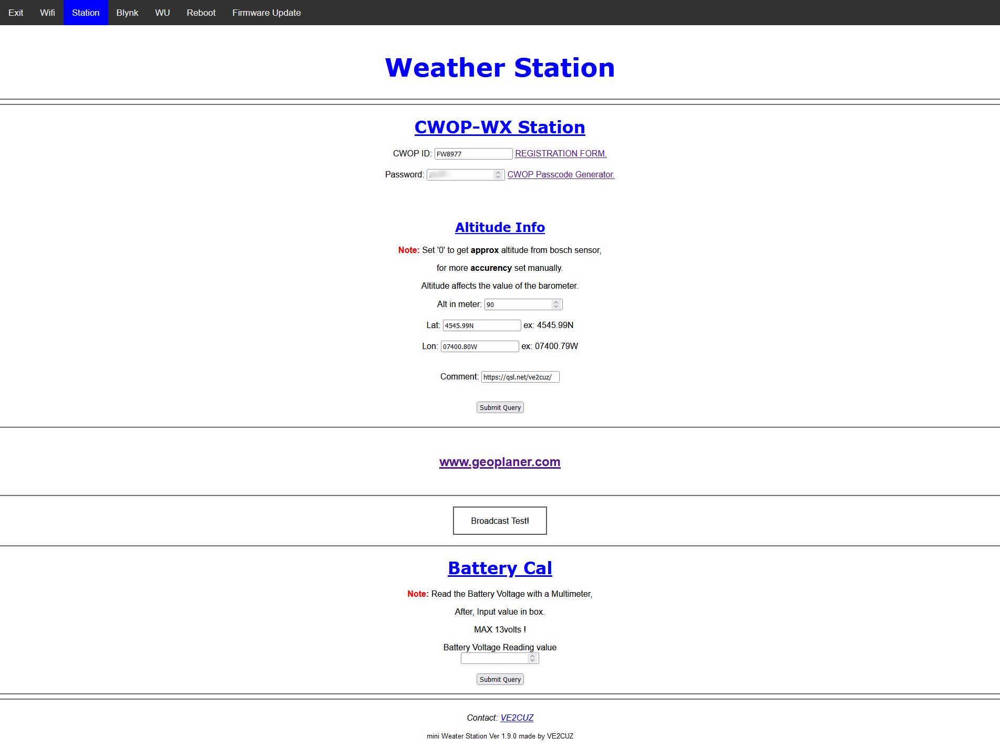
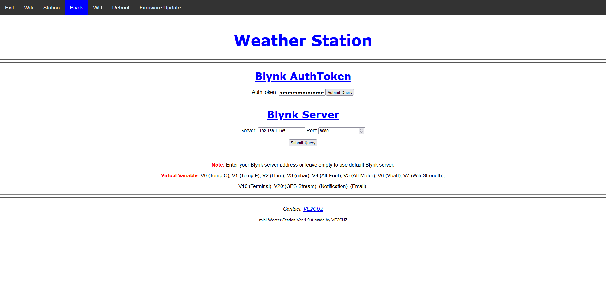
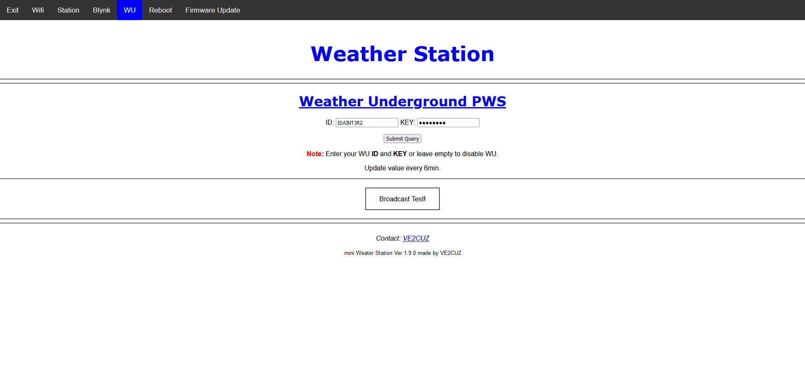
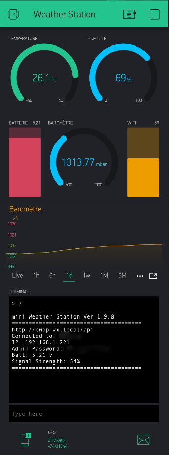
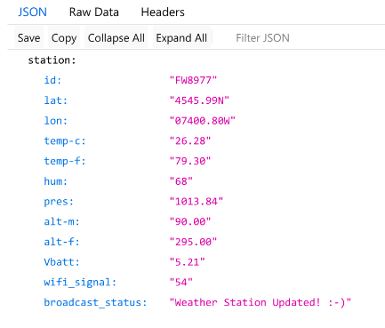

# miniWeatherStation with NodeMCU + bme280

# Publish on APRS Server and WeatherUnderGround

# miniWeatherStation LIVE! http://miniaprsstation.mooo.com/

# Ref: https://lastminuteengineers.com/bme280-esp8266-weather-station/

# https://aprs.fi/#!call=a%2FFW8977&timerange=3600&tail=3600

#
#

# https://www.wunderground.com/dashboard/pws/ISAINTJR2

# Main Web Page

# Admin

# Schematic

# Blynk

# API

